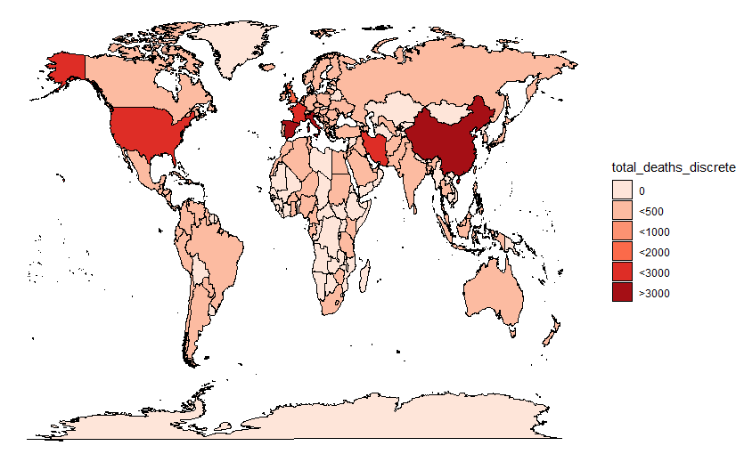

# Coronavirus Worldwide Visualization 

### Spread of the Coronavirus Globally on 29/3/2020 
Choropleths which show *total_cases* and *total_deaths* of coronavirus worldwide were created using **map_data**, **ggplot2** in R and **coronavirus dataset** found at [ourworldindata](https://ourworldindata.org/coronavirus-source-data)

*Note: All images were created by myself using ggplot2 in R.*

